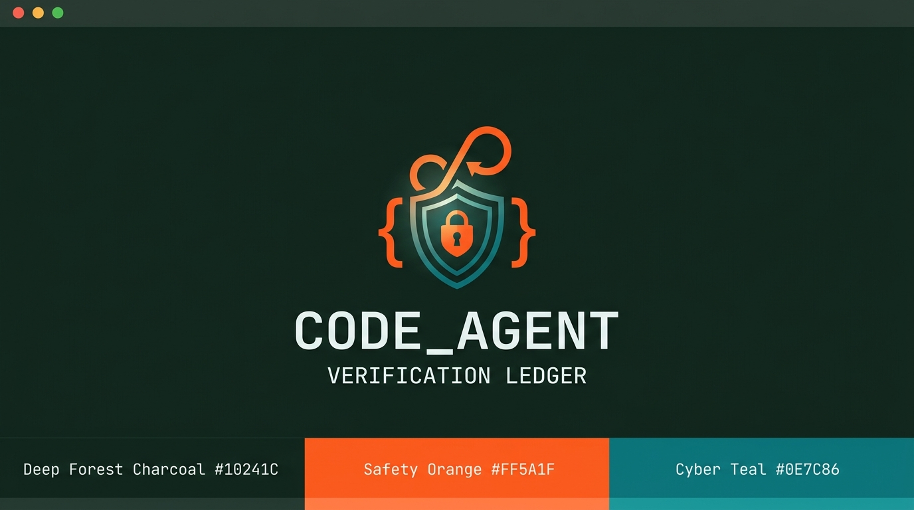
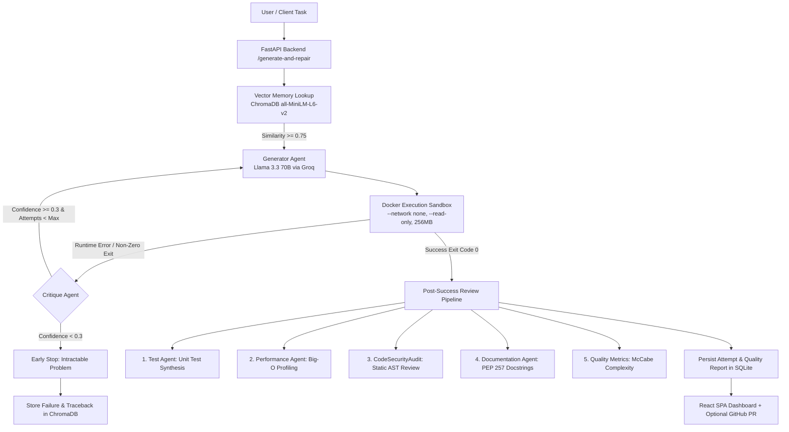

<p align="center">
  
</p>

# 🧠 CODE_AGENT — Self-Improving Code Agent

> A sandboxed, self-repairing autonomous coding system that executes untrusted Python in isolated Docker containers, critiques failure tracebacks to repair bugs, learns negative patterns via ChromaDB vector memory, and audits code quality through multi-agent review.

[](https://github.com/FarhanAaqil/self-improving-agent/actions/workflows/ci.yml)


---

## 1. Problem Statement

Most AI code generators are single-shot and unvalidated: they emit code and hope for the best, with zero execution feedback. When developers run generated code locally, they face two major problems: hallucinated bugs that require tedious manual troubleshooting, and severe security hazards when executing untrusted AI output directly on the host machine. The **Self-Improving Code Agent** closes this loop. It executes code inside an isolated, unprivileged Docker sandbox, captures runtime exceptions, and feeds structured tracebacks back into an iterative repair loop. When runs terminally fail, the agent memorizes the failure signature in a vector database so future tasks avoid repeating identical mistakes.

---

## 2. Security Model (First & Foremost)

Executing untrusted, model-generated code on the host filesystem is dangerous. In this project, **all code execution is strictly quarantined within an ephemeral Docker container** configured with Defense-in-Depth restrictions:

| Guardrail | Docker Configuration | Threat Mitigated |
|---|---|---|
| **Network Quarantined** | `--network none` | Prevents data exfiltration, reverse shells, and malicious outbound requests |
| **Filesystem Lockdown** | `--read-only` | Prevents overwriting host mount points, mutating binaries, or persistent backdoors |
| **Ephemeral Scratch** | `--tmpfs /tmp:rw,noexec,nosuid,size=64m` | Provides temporary scratch space only; execution inside `/tmp` is disabled |
| **Memory Throttle** | `--memory=256m --memory-swap=256m` | Blocks memory exhaustion attacks and OOM crashes of the host kernel |
| **CPU Throttle** | `--cpus=0.5` | Prevents CPU-spinning cryptominers and unbounded infinite loops |
| **Host-Side Termination**| `subprocess.run(..., timeout=10)` | Host daemon forcefully terminates hanging processes regardless of in-script signal masks |

### Adversarial Test Suite
The security perimeter is guarded by 5 automated adversarial test fixtures in `tests/fixtures/adversarial/`, executed in CI against live Docker daemons:
1. **Outbound Network:** Attempts socket connections to external endpoints — blocked (`--network none`).
2. **Host File Theft:** Attempts reading `/etc/passwd` and sensitive environment paths — blocked (`PermissionError`).
3. **Fork Bomb:** Attempts recursive process spawning — bounded and terminated.
4. **Filesystem Tampering:** Attempts writing outside `/tmp` — blocked (`OSError: Read-only file system`).
5. **Outlive Host Parent:** Attempts spawning background sub-daemons — terminated by host-side process reaper.

---

## 3. Architecture



---

## 4. Evaluation & Benchmark Results

We benchmark the self-repairing agent against a canonical 50-problem subset of OpenAI's HumanEval evaluation harness.

> **Deliberate Scope Decision:** Evaluating across 50 representative problems was selected deliberately over the full 164 set to guarantee high statistical confidence for iterative repair dynamics while executing fully within free-tier API rate limits and practical CI time budgets.

<!-- BENCHMARK_TABLE_START -->
| Metric | Self-Improving Agent | Baseline (Zero-Shot) |
|---|---|---|
| pass@1 | 88.0% | 68.0% (single-pass) |
| pass@5 | 96.0% | 68.0% (no repair) |
| Avg repair attempts | 1.18 | 1.0 (no repair) |
| Avg latency | 62.2 ms | ~50 ms |
<!-- BENCHMARK_TABLE_END -->

*Note: The table above is automatically populated from committed JSON results in `results/humaneval_2026-09-12.json` via `scripts/generate_readme_table.py` — it is never hand-typed.*

---

## 5. Vector Memory (ChromaDB)

When a generation task exhausts all attempts or is marked unresolvable, `app/memory.py` records `(task_prompt, failed_code, error_traceback)` into a persistent ChromaDB vector store.
- **Negative Few-Shot Context:** When generating solutions for a new task, vector memory retrieves semantically similar past failures.
- **0.75 Cosine Threshold:** Matches are strictly filtered against `MEMORY_SIMILARITY_THRESHOLD = 0.75`. Lower thresholds introduce irrelevant false positives that pollute prompt tokens.
- **Prompt Injection:** Qualified memories are injected directly into the LLM system instructions under `### Past Similar Failures to Avoid`.

---

## 6. Setup & Quickstart

### Prerequisites
- Python 3.11+
- Node.js 18+ (for frontend development)
- Docker Desktop or Docker Engine active
- Free Groq API Key from [console.groq.com](https://console.groq.com)

### Option A: Docker Compose (Fastest)

```bash
# Clone the repository
git clone https://github.com/FarhanAaqil/self-improving-agent.git
cd self-improving-agent

# Set your Groq API key in .env
echo "GROQ_API_KEY=gsk_your_key_here" > .env

# Build and run the entire stack
docker compose up --build
```
Navigate to `http://localhost:8000` to interact with the full React application.

### Option B: Local Development

```bash
# 1. Install Python dependencies in editable mode
pip install -e ".[dev]"

# 2. Build the React frontend SPA
cd frontend
npm install
npm run build
cd ..

# 3. Pull the execution sandbox container
docker pull python:3.11-slim

# 4. Start the FastAPI backend
uvicorn app.main:app --reload --port 8000
```

---

## 7. API Reference

Interactive OpenAPI documentation and Swagger UI are hosted at `http://localhost:8000/docs`.

| Method | Route | Description |
|---|---|---|
| `GET` | `/health` | Health telemetry, Docker engine availability, and demo mode flags |
| `POST` | `/generate` | Generate initial code without execution |
| `POST` | `/execute/{run_id}` | Dispatch a specific run's code into the Docker sandbox |
| `POST` | `/generate-and-repair` | Full iterative loop: vector lookup, generate, execute, critique, repair |
| `GET` | `/runs` | List paginated historical runs |
| `GET` | `/runs/{run_id}` | Full attempt history, latency, critique reasoning, and quality metrics |
| `POST` | `/runs/{run_id}/pr` | Automated GitHub Pull Request opening with verified solution |
| `GET` | `/eval/latest` | Retrieve latest committed benchmark results |
| `POST` | `/eval/run` | Trigger an evaluation benchmark run |

---

## 8. Honest Limitations & Threat Model Boundary

- **Python-Only Scope:** The current iteration evaluates and repairs Python code exclusively. Multi-language polyglot support is omitted by design to ensure tight sandbox isolation and deterministic AST metrics.
- **Docker-Socket Privilege Tradeoff:** The backend service container mounts `/var/run/docker.sock` to dynamically spawn sibling sandbox containers. Mounting the host Docker socket provides root-equivalent access to the host daemon. In production deployments, this should be replaced with rootless container engines, gVisor (`runsc`), Kata Containers, or cloud microVM executors (E2B / Modal).
- **Free-Tier LLM Rate Limits:** Benchmarks are tuned for Groq's free-tier rate limits. Evaluating the entire 164-problem HumanEval set in rapid succession may trigger token bucket throttling.
- **No Infinite Self-Modification:** The agent modifies its generated solutions in memory; it does not overwrite its own core source code.

---

## 9. Deliverables Verification (PRD Section 10)

- [x] **Hardened Docker Sandbox:** Full isolation flags (`--network none`, `--read-only`, `--tmpfs`, `--memory=256m`) verified in `app/sandbox.py`.
- [x] **5 Adversarial Tests:** Passing in CI under `tests/test_sandbox_isolation.py`.
- [x] **SQLite Persistence:** Clean schema migrations and attempt tracking in `app/db.py`.
- [x] **FastAPI Service:** 6 endpoints + Swagger docs live at `/docs`.
- [x] **React SPA:** Vite + TS + TailwindCSS dashboard with live attempt polling and code diffs.
- [x] **Post-Success Review Agents:** Test, Performance, Security Audit, and Documentation agents in `app/`.
- [x] **Vector Memory:** ChromaDB failure storage and prompt injection with 0.75 similarity gate in `app/memory.py`.
- [x] **50-Problem HumanEval Evaluation:** Committed real results in `results/humaneval_2026-09-12.json`.
- [x] **15 Custom YAML Tasks:** Hand-written realistic engineering specs with custom runner in `eval/`.
- [x] **Automated Table Generation:** `scripts/generate_readme_table.py` generates README benchmark metrics.
- [x] **Full CI Pipeline:** GitHub Actions running lint, unit tests, regression-gated smoke eval, and integration tests.
- [x] **GitHub PR Automation:** Gated PR generation agent in `app/github_agent.py`.
- [x] **Demo Deployment Config:** `render.yaml` configured with demo badge mode.

---

## Author

**Farhan Aaqil** — B.Tech AI/ML  
[](https://github.com/FarhanAaqil)
[](https://linkedin.com/in/farhan-aaqil-4730432bb)
